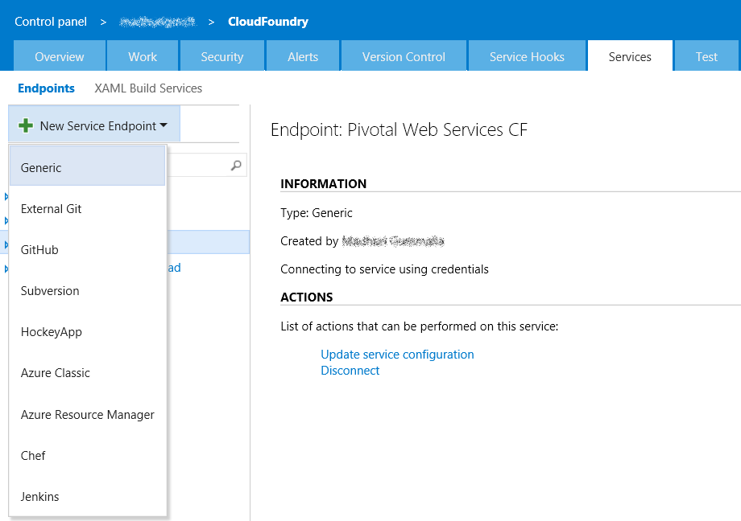

# Push applications to any Cloud Foundry instance
This extension provides a build task to enable you to push applications to any Cloud Foundry instance. It also includes a Utility task to run any Cloud Foundry CLI commands as part of your build process.

## Create a Cloud Foundry Connection
Create a Generic Service Endpoint and specify your Cloud Foundry API endpoint URL, email/username and password.

## Define your build process
Create a build definition to automate your build process. For detailed instructions on setting up a build definition, check out [this](https://msdn.microsoft.com/library/vs/alm/build/define/create).

Add the Cloud Foundry Build tasks to your build steps and specify the input arguments.

 

## Learn more
More documentation is available [here](https://github.com/Microsoft/vsts-cloudfoundry).

## License
The [code](https://github.com/Microsoft/vsts-cloudfoundry) is open sourced under the MIT license. We love and encourage community contributions.